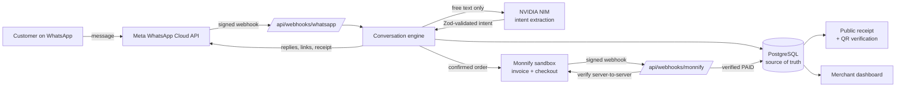

# Confirmly

**Turn WhatsApp orders into verified payments.**

Confirmly converts WhatsApp conversations into structured, payment-ready
orders, verifies payment through **Monnify**, and sends a trusted digital
receipt — so small merchants never fulfil an unpaid order again.

> From chat to confirmed payment.

## The problem

Small WhatsApp merchants manually read scattered messages, calculate totals,
send account details, inspect payment screenshots, match bank transfers,
write receipts and track fulfilment. The result: wrong totals, unmatched
transfers, duplicate fulfilment, disputes, and hours of wasted time — and a
thriving market for **faked payment screenshots**.

## The solution

A customer sends:

> I need two black polo shirts, large size, delivered to Yaba.

Confirmly then:

1. Receives the message through the **WhatsApp Cloud API** (signed webhook).
2. Uses **NVIDIA NIM** (`nvidia/nemotron-3-nano-30b-a3b`) to extract
   structured order intent — never prices, never stock.
3. Matches the request against the merchant's real catalogue with a
   confidence policy (≥0.85 auto-select · 0.60–0.84 offer alternatives ·
   <0.60 ask again).
4. Asks **one clarification question at a time** when something is ambiguous.
5. Calculates all money **server-side, in integer kobo**, from PostgreSQL.
6. Shows a structured summary and requires explicit confirmation
   (`Confirm order · Edit order · Talk to merchant` buttons).
7. Creates a **Monnify sandbox invoice** with a unique reference and sends
   the secure payment link in chat.
8. Receives Monnify's webhook, validates its **HMAC-SHA512 signature**, and
   then **verifies the transaction directly with Monnify's API**.
9. Marks the order `PAID` **only after server-side verification** — a
   screenshot, redirect, chat claim or success-page visit can never do it.
10. Issues a public, verifiable receipt (256-bit token + QR code) and sends
    it on WhatsApp.
11. Updates the merchant dashboard and a chronological audit timeline.

```text
Expected server calculation for the demo order:
2 × Classic Polo Shirt   NGN 24,000
Delivery to Yaba         NGN  2,500
TOTAL                    NGN 26,500   (2,650,000 kobo)
```

## Architecture



**Rules the architecture enforces**

- PostgreSQL is the source of truth for customers, conversations, orders,
  payments and events; Monnify is the source of truth for payment state;
  WhatsApp is only a channel.
- The AI proposes intent; server code validates and decides. The intent
  schema has **no money fields**, so an invented price is unrepresentable.
- Every webhook is authenticated, idempotent and auditable.
- Confirmed order items store immutable name/price snapshots.
- No client component talks to Meta, NVIDIA or Monnify.

## Features

- 📱 Mobile-first customer pages (pay page, receipt, verification)
- 🧾 Verifiable receipts: high-entropy token, QR code, revocation,
  `VALID CONFIRMLY RECEIPT` / `RECEIPT NOT VALID`
- 🛍️ Product catalogue with aliases, variants (size/colour), stock and
  delivery zones (editable fees)
- 💬 Conversation transcripts with human takeover / resume automation
- 🕒 Order timeline: message → extraction → match → confirmation → invoice →
  webhook → verification → receipt → WhatsApp confirmation
- 🔁 Reconciliation job that re-verifies stale pending payments (recovers
  missed webhooks); daily Vercel cron + manual trigger
- 🧪 79 unit/integration tests + Playwright browser tests
- 🎭 Clearly-labelled Demo Mode (fixtures only, visible banner, never silent)

## Stack

Next.js 15 (App Router, strict TypeScript) · Tailwind CSS 4 · PostgreSQL ·
Prisma 6 · Zod · jose + bcryptjs (sessions) · NVIDIA NIM (OpenAI-compatible)
· Meta WhatsApp Cloud API · Monnify sandbox · qrcode · Vitest · Playwright ·
Vercel + Prisma Postgres.

## Repository structure

```text
app/
  (auth)/login/          merchant sign-in
  dashboard/             overview, orders, products, conversations, settings
  pay/[orderReference]/  public payment page (display-only, never mutates)
  receipt/[token]/       public receipt with QR
  verify/receipt/[token] public receipt verification
  api/
    health/              liveness + safe integration diagnostics
    webhooks/whatsapp/   GET challenge, POST signed inbound events
    webhooks/monnify/    POST signed payment events
    whatsapp/test/       merchant-only test send
    orders/[id]/confirm  fulfilment progression
    orders/[id]/invoice  fresh invoice (new unique reference)
    payments/[id]/verify merchant-triggered live verification
    payments/reconcile   stale-payment reconciliation (cron/manual)
    demo/reset           protected demo fixtures reset
components/              UI primitives + logo
lib/
  ai/                    NIM client, strict Zod schema, fallback parser
  whatsapp/              signature check, payload parsing, send client
  monnify/               auth token cache, invoice/verify client, signature
  orders/                matching, conversation engine, drafts, audit, summaries
  payments/              payment service (the ONLY path to PAID), webhook processor
  auth.ts · db.ts · env.ts · logger.ts · money.ts · rate-limit.ts · receipts.ts
prisma/                  schema, migrations, seed (Ada Styles)
scripts/                 import-local-secrets · verify-no-secrets · sync-vercel-env · smoke-test
tests/                   unit / integration / e2e / fixtures
```

## Getting started

### Prerequisites

- Node.js 20.9+ (LTS)
- A PostgreSQL database (any provider; the project was built against
  [Prisma Postgres](https://www.prisma.io/postgres))
- Meta developer app with WhatsApp product (test number is fine)
- NVIDIA API key (build.nvidia.com)
- Monnify sandbox account (API key, secret key, contract code)

### Local setup

```bash
npm install

# Option A: import credentials from a local secrets file (never committed)
npm run secrets:import          # writes .env.local, prints names only

# Option B: copy .env.example to .env.local and fill it in by hand.
# Prisma CLI reads .env — put DATABASE_URL there too (unquoted).

npx prisma migrate deploy       # apply committed migrations
npm run db:seed                 # Ada Styles catalogue + demo merchant login

npm run dev                     # http://localhost:3000
```

The seed creates the demo merchant **Ada Styles** with:

| Product | Price | Variants |
|---|---|---|
| Classic Polo Shirt | NGN 12,000 | Black/White/Navy × S/M/L/XL |
| Premium Hoodie | NGN 25,000 | Black/Grey × M/L/XL |
| Canvas Tote Bag | NGN 8,500 | — |

Delivery zones: Yaba 2,500 · Surulere 3,000 · Ikeja 3,500 · Lekki 5,000 ·
Pickup 0 (all NGN).

### Environment variables

Names only — values live in `.env.local` (git-ignored) or Vercel.

| Variable | Purpose |
|---|---|
| `APP_URL` | Public base URL (used in links/receipts) |
| `DATABASE_URL` | PostgreSQL connection string (unquoted) |
| `AUTH_SECRET` | Session JWT signing key (32 random bytes) |
| `RECEIPT_TOKEN_SECRET` | Receipt token MAC key |
| `DEMO_MERCHANT_EMAIL` / `DEMO_MERCHANT_PASSWORD` | Seeded dashboard login |
| `WHATSAPP_ACCESS_TOKEN` | Meta Graph API token |
| `WHATSAPP_PHONE_NUMBER_ID` | Sending phone number id |
| `WHATSAPP_BUSINESS_ACCOUNT_ID` | WABA id |
| `WHATSAPP_APP_SECRET` | Webhook signature validation |
| `WHATSAPP_VERIFY_TOKEN` | Webhook GET challenge |
| `WHATSAPP_GRAPH_VERSION` | e.g. `v23.0` |
| `NVIDIA_API_KEY` / `NVIDIA_BASE_URL` / `NVIDIA_ORDER_MODEL` | NIM extraction |
| `MONNIFY_BASE_URL` / `MONNIFY_API_KEY` / `MONNIFY_SECRET_KEY` / `MONNIFY_CONTRACT_CODE` | Payments (contract code ≠ wallet account number!) |
| `DEMO_MODE` | `true` only for fixture-based review — shows a banner |
| `CRON_SECRET` | Optional: authorizes the Vercel reconciliation cron |

### Provider setup

**Meta (WhatsApp Cloud API)**

1. developers.facebook.com → your app → WhatsApp → API setup. Note the phone
   number id, WABA id, and generate an access token.
2. WhatsApp → Configuration → Webhook:
   - Callback URL: `https://<your-domain>/api/webhooks/whatsapp`
   - Verify token: your `WHATSAPP_VERIFY_TOKEN`
   - Subscribe to the **`messages`** field.
3. ⚠️ Meta's **test number can only message verified test recipients** — add
   your phone under "To" recipients. Free-form text only works inside a
   24-hour customer-service window; the `hello_world` template always works.

**NVIDIA NIM**

1. build.nvidia.com → get an API key (`nvapi-…`).
2. The app uses the OpenAI-compatible endpoint
   `https://integrate.api.nvidia.com/v1` with model
   `nvidia/nemotron-3-nano-30b-a3b`, temperature 0.15, 20 s timeout, two
   transient retries, one JSON-repair attempt, and a deterministic fallback
   parser when the service is unavailable.

**Monnify sandbox**

1. app.monnify.com (sandbox) → Settings → API Keys: API key (`MK_TEST_…`),
   secret key, and **contract code** (from Contracts — *not* the wallet
   account number).
2. Settings → Webhooks: set the transaction-completion webhook to
   `https://<your-domain>/api/webhooks/monnify`.
3. To simulate a bank transfer in sandbox, use Monnify's bank-transfer
   simulator on the checkout page (or pay the dynamic account with the
   sandbox tools). Card testing works with Monnify's published test cards.
   **No real money moves in sandbox.**

### Tests

```bash
npm run lint        # eslint
npm run typecheck   # tsc --noEmit
npm run test        # vitest unit + integration (needs DATABASE_URL)
npm run test:e2e    # Playwright (starts next dev on :3100)
npm run build       # production build
npm run secrets:scan  # fails on any leaked secret
```

### Deployment (Vercel)

```bash
npm i -g vercel
vercel login
vercel link
node scripts/sync-vercel-env.mjs   # pushes .env.local values, never echoes them
npx prisma migrate deploy          # against the production DATABASE_URL
vercel deploy --prod
node scripts/smoke-test.mjs https://<your-deployment>
```

Set `APP_URL` to the final production domain (and re-deploy) so WhatsApp
links and receipts point at the right host. Then configure the two provider
callbacks above.

## Demo script (2 minutes)

1. Open the landing page → **Open merchant dashboard** → sign in with the
   demo credentials (from your environment, never hardcoded).
2. In WhatsApp, message the business number:
   *“I need two black polo shirts, large size, delivered to Yaba.”*
3. Watch the bot reply with the NGN 26,500 summary → tap **Confirm order** →
   receive the Monnify payment link.
4. Pay in the sandbox (bank-transfer simulator). Within seconds the webhook
   is verified and the receipt link arrives in chat.
5. Try to cheat: send *“I have paid, see the screenshot.”* → Confirmly
   explains screenshots are never accepted and checks Monnify directly.
6. Open the receipt link → scan the QR → **VALID CONFIRMLY RECEIPT**. Change
   one character of the token → **RECEIPT NOT VALID**.
7. Dashboard → the order's timeline shows every step, and Settings →
   integration health shows live provider connectivity.

## Limitations

- **Meta test numbers** only deliver to verified test recipients, and
  free-form messages require an open 24-hour session window.
- **Sandbox only:** Monnify payment states are simulated; going live needs a
  KYC'd Monnify account and a production contract code.
- Single-merchant webhook routing: inbound WhatsApp events are routed to the
  first merchant (the seeded demo shop). Multi-number routing would key on
  `phone_number_id` per merchant.
- The in-memory rate limiter is per-instance; swap for Redis at scale.
- WhatsApp access tokens from the Meta dashboard expire — rotate them (or
  use a system-user token) for long-lived deployments.

## Security

See [SECURITY.md](SECURITY.md). Highlights: signed webhooks (401 on
mismatch), idempotent event handling, server-only secrets with a pre-push
scanner, bcrypt + HTTP-only JWT sessions, merchant-scoped queries,
high-entropy receipt tokens, and **the no-screenshot payment rule** — only a
verified Monnify server response can mark an order paid.

## Team

Built by **Obiajulu-gif** (Emmanuel Okoye) for the hackathon, with Claude
Code as pair programmer.

## License

[MIT](LICENSE)
